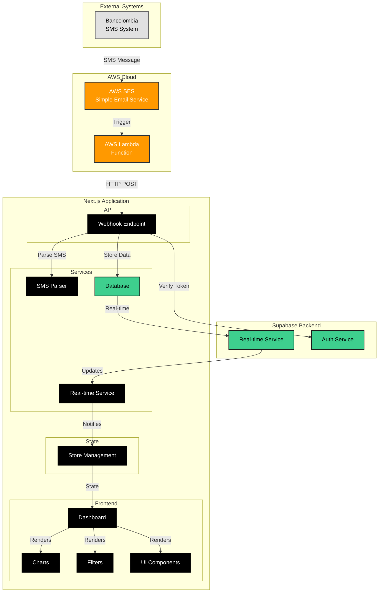
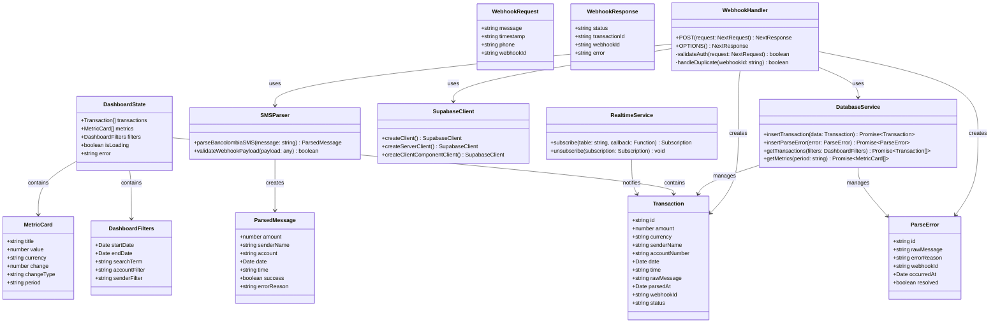
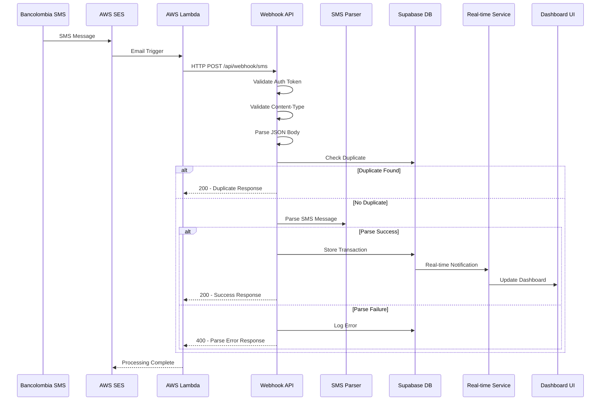
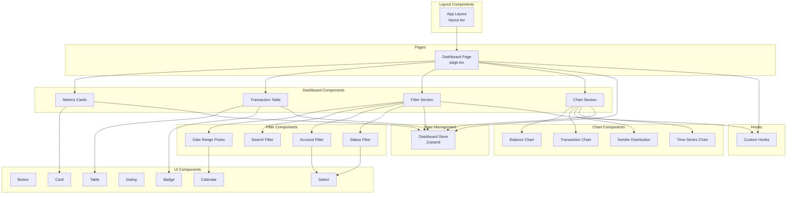

# Diagrama UML - BMAD Bank Deposits Application

## Diagrama de Arquitectura del Sistema

## Diagrama de Clases Principal

## Diagrama de Secuencia - Flujo de Webhook

## Diagrama de Componentes - Frontend

## Tecnologías y Arquitectura

### Stack Tecnológico
- **Frontend**: Next.js 15 (App Router), React 19, TypeScript
- **UI**: Tailwind CSS, shadcn/ui, Radix UI
- **Estado**: Zustand
- **Backend**: Next.js API Routes (Edge Functions)
- **Base de Datos**: Supabase (PostgreSQL)
- **Autenticación**: Bearer Token Authentication
- **Real-time**: Supabase Real-time Subscriptions
- **Charts**: Recharts
- **Testing**: Jest, React Testing Library

### Servicios Externos
- **AWS SES**: Recepción de emails/SMS
- **AWS Lambda**: Procesamiento de triggers
- **Bancolombia**: Sistema bancario que envía SMS

### Características Clave
- **Procesamiento en Tiempo Real**: SMS → Lambda → Webhook → DB → UI
- **Autenticación Segura**: Bearer tokens para webhooks
- **Manejo de Errores**: Logging de errores de parsing
- **Prevención de Duplicados**: Validación de webhookId
- **Localización**: Formato de peso colombiano y fechas
- **Testing Comprehensivo**: 46 casos de prueba